# Original example parse failures

Production source: `5e4eb8224a474f3ef7426542f4ced8476b26b678`. All 79 unchanged original parse assertions passed against upstream; 66 pass and 13 fail against Native. These are known parser gaps, not skipped tests.

## Flowchart: Expanded Node Shapes

FAIL
[MermaidDiagnostic(code=UNSUPPORTED_SYNTAX, message=No such shape: manual-input., location=SourceLocation(line=2, column=5))]

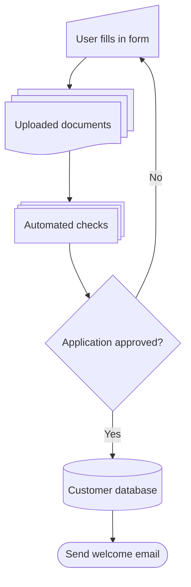

## Kanban Diagram: Mermaid Sprint Board

FAIL
[MermaidDiagnostic(code=UNSUPPORTED_DIAGRAM, message=Unsupported Mermaid diagram header: ---, location=SourceLocation(line=1, column=1))]

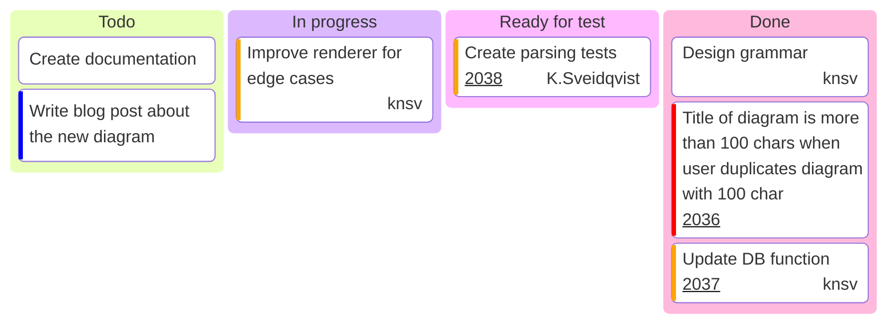

## Radar Diagram: Student Grades

FAIL
[MermaidDiagnostic(code=UNSUPPORTED_DIAGRAM, message=Unsupported Mermaid diagram header: ---, location=SourceLocation(line=1, column=1))]

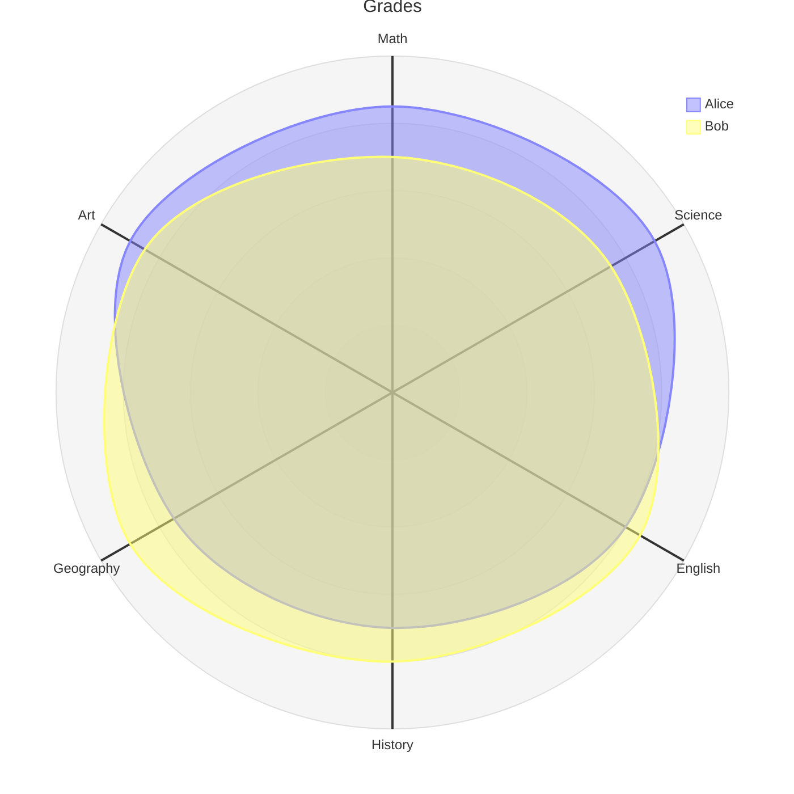

## XY Chart: Coffee Sales with Data Labels

FAIL
[MermaidDiagnostic(code=UNSUPPORTED_DIAGRAM, message=Unsupported Mermaid diagram header: ---, location=SourceLocation(line=1, column=1))]

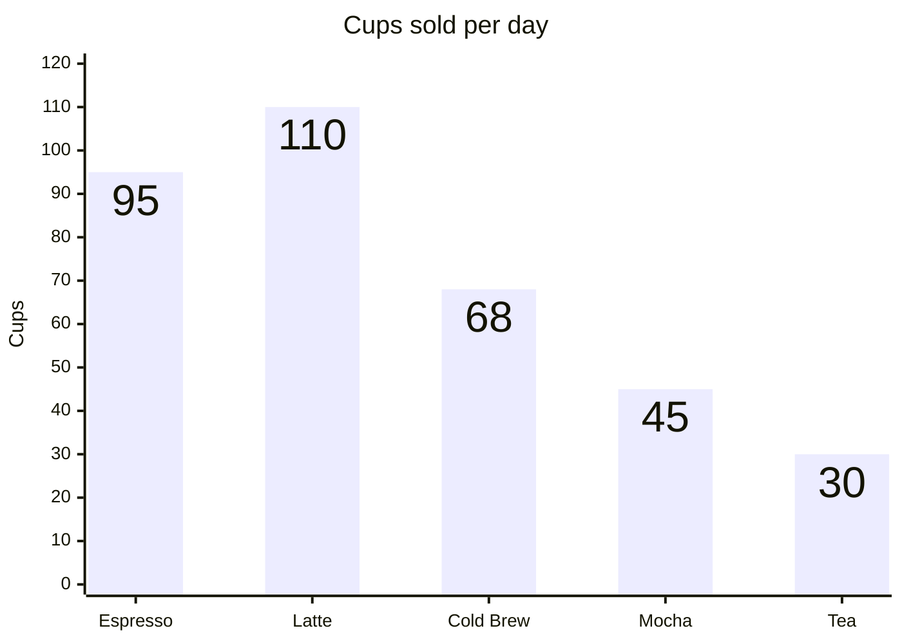

## XY Chart: Sign-ups vs Churn

FAIL
[MermaidDiagnostic(code=UNSUPPORTED_DIAGRAM, message=Unsupported Mermaid diagram header: ---, location=SourceLocation(line=1, column=1))]

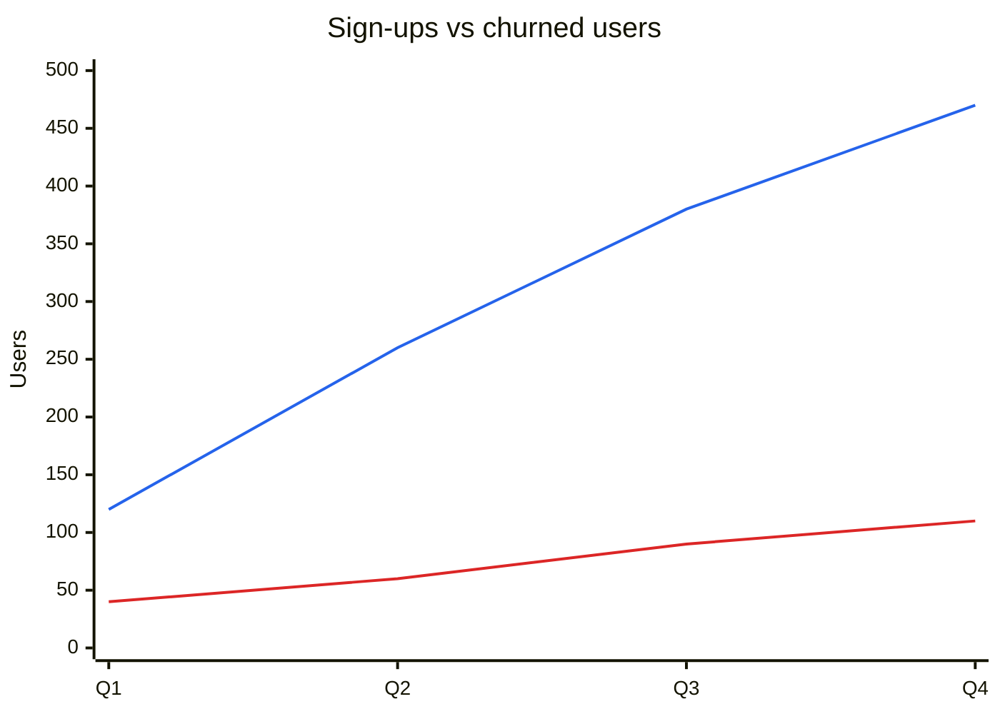

## Sankey Diagram: Energy Flow (UK)

FAIL
[MermaidDiagnostic(code=UNSUPPORTED_DIAGRAM, message=Unsupported Mermaid diagram header: ---, location=SourceLocation(line=1, column=1))]

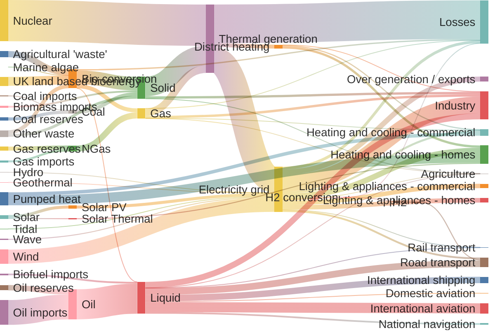

## Packet Diagram: TCP Packet

FAIL
[MermaidDiagnostic(code=UNSUPPORTED_DIAGRAM, message=Unsupported Mermaid diagram header: ---, location=SourceLocation(line=1, column=1))]

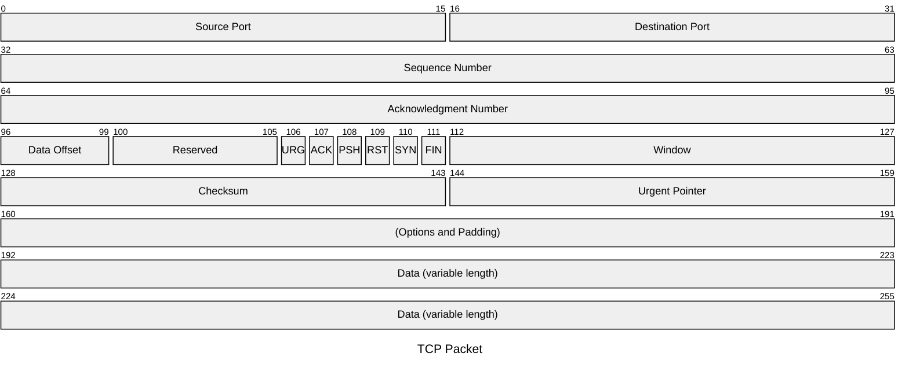

## Block Diagram: Three-Tier Web Architecture

FAIL
[MermaidDiagnostic(code=UNSUPPORTED_SYNTAX, message=Expected block identifier, location=SourceLocation(line=3, column=1))]

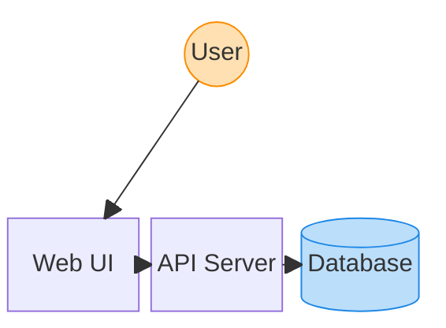

## Block Diagram: Block Arrows and Nested Blocks

FAIL
[MermaidDiagnostic(code=UNSUPPORTED_SYNTAX, message=Expected block identifier, location=SourceLocation(line=3, column=1))]

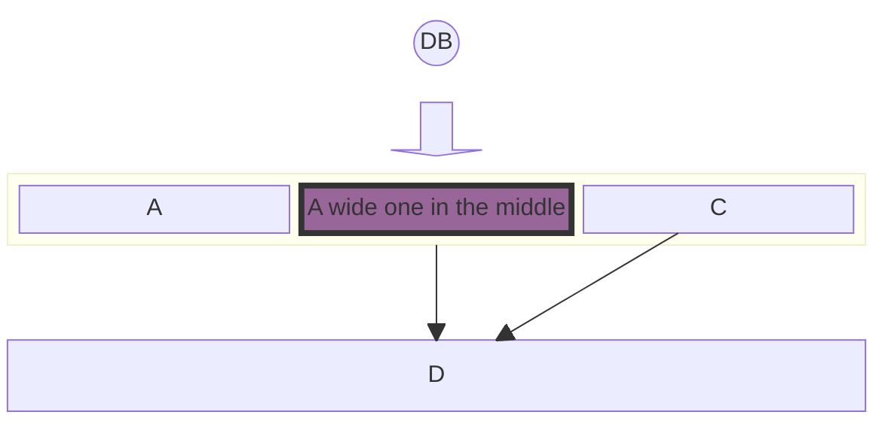

## Treemap: Monthly Household Budget

FAIL
[MermaidDiagnostic(code=UNSUPPORTED_DIAGRAM, message=Unsupported Mermaid diagram header: ---, location=SourceLocation(line=1, column=1))]

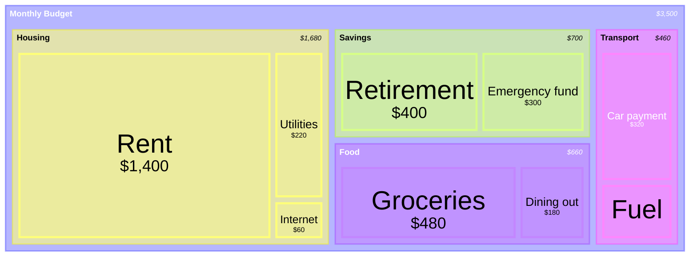

## TreeView: Annotations

FAIL
[MermaidDiagnostic(code=UNSUPPORTED_DIAGRAM, message=Unsupported Mermaid diagram header: ---, location=SourceLocation(line=1, column=1))]

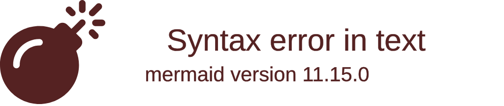

## TreeView: File-Type Icons via Config Maps

FAIL
[MermaidDiagnostic(code=UNSUPPORTED_DIAGRAM, message=Unsupported Mermaid diagram header: ---, location=SourceLocation(line=1, column=1))]

## Wardley Maps: GPT Tokeniser Architecture

FAIL
[MermaidDiagnostic(code=UNSUPPORTED_SYNTAX, message=Invalid Wardley name, location=SourceLocation(line=24, column=1))]

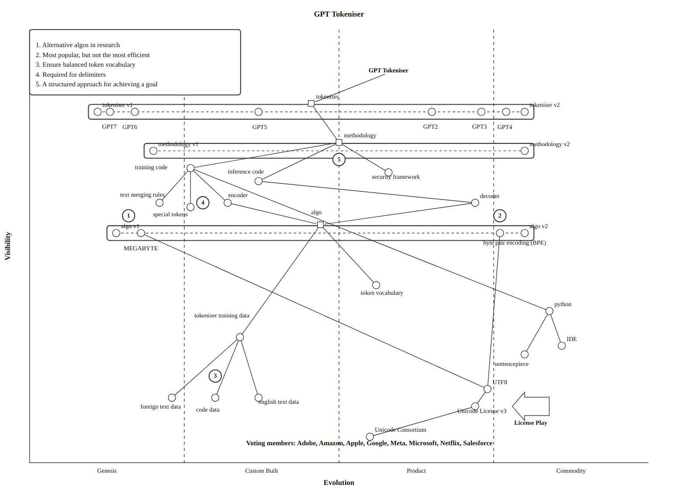
